```{r setup, include=FALSE, lang="pl"}
knitr::opts_chunk$set(echo = TRUE)
```

|

\begin{center}
\rule{1\textwidth}{.4pt}
\end{center}


```{r fig.align="center", figures-side, fig.show="hold", echo=FALSE, out.height = '8%'}

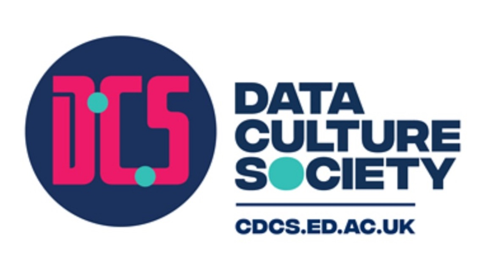

```

```{r fig.align="center", fig.show="hold", echo=FALSE, out.width = '95%'}

```

\renewcommand{\footnoterule}{\vfill\kern -3pt \hrule width 1\columnwidth \kern 2.6pt}
\def\figurename{Fig.}

\pagebreak
\begin{center}
\rule{1\textwidth}{.4pt}
\end{center}

## Po co tworzyć własne aplikacje internetowe (i dlaczego z Shiny)? {#why}

|
|
Czasami interpretowalny kod, wraz z wygenerowaną dokumentacją (np. tablice lub wizualizacje), może nie wystarczyć, by skutecznie przekazać rezultaty czyjejś pracy. Dzieje się tak zwłaszcza wtedy, gdy pewna doza aktywnej interakcji jest wymagana, by w pełni zrozumieć pozyskane dane, a odbiorca nie posiada odpowiedniej wiedzy o tym, jak napisać własny kod. Redukcja interakcji do pasywnego odbioru jest też często nużąca dla osób spoza kręgów akademickich, nie mających żadnego pojęcia o szerszym kontekście badań.

Problemy te można łatwo rozwiązać, dając odbiorcom narzędzia do eksploracji zarówno danych jak i uczestnictwa w procesie analizy, w formie interaktywnej aplikacji internetowej. Danie takich możliwości pozwala na organiczne zrozumienie, co właściwie oznaczają wykorzystane dane oraz metody i dlaczego autor dokonał konkretnych wyborów podczas analizy. Tworzenie dedykowanych aplikacji internetowych może również usprawnić same badania, zapewniając w łatwy sposób automatyzację regularnie używanych rozwiązań, bez potrzeby zmiany samego kodu w każdym przypadku.

Choć tworzenie aplikacji internetowych nie było oryginalnym celem, dzięki bibliotece SHINY i związanym z nią rozwiązaniom sieciowym stało się to jedną z coraz szybciej rozbudowywanych możliwości języka kodowania R w środowisku RStudio. SHINY to cała struktura rozwiązań do tworzenia i udostępniania/wdrażania aplikacji. Choć może to brzmieć skomplikowanie, jest to prawdopodobnie najłatwiejszy sposób na poznanie podstaw tworzenia aplikacji bez uprzedniej wiedzy o językach do tego używanych (np. JavaScript). Może być polecana zwłaszcza osobom regularnie pracującym w R, ale myślącym o dalszym rozwoju w kierunku właściwego programowania.

Jeśli już wiesz, jak kodować w R, dlaczego nie zrobić kroku dalej, w kierunku szeroko pojętego „application development”?


\pagebreak
\begin{center}
\rule{1\textwidth}{.4pt}
\end{center}

## Wstęp {#introduction}

|
| 
**Czego się (lub czego nie) nauczysz**

| 
Celem tego samouczka, i związanych z nim warsztatów, jest przede wszystkim zapoznanie Cię ze wszystkimi kluczowymi etapami tworzenia aplikacji internetowej w Shiny. W samouczku nie pokażemy ani nie omówimy wszystkich funkcji i powiązanych możliwości obecnych w głównej bibliotece Shiny lub pomocniczych bibliotekach i serwisach internetowych - całe książki zostały już napisane na te tematy. Zamiast tego samouczek zapewnia, że pod koniec będziesz rozumiał, jak działają aplikacje internetowe, znał podstawy niezbędne do stworzenia aplikacji od podstaw w R i wiedział, gdzie szukać dalszych informacji jeżeli zdecydujesz się na dalszą pracę z Shiny.

| 
**Układ samouczka**

| 
Po pierwsze, zobacz [*Zanim zaczniesz*](#beforestart) aby sprawdzić, które biblioteki musisz zainstalować. Dodatkowo, spójrz na  [*Uruchamianie aplikacji Shiny*](#Starting) aby uzyskać informacje o tym, jak wygląda otwieranie i konfigurowanie nowego pliku skryptu w celu pisania aplikacji z Shiny.

Ze względu na znaczenie teorii w zrozumieniu wewnętrznej struktury i działania aplikacji internetowej, samouczek rozpoczyna się od krótkiego opisu kluczowych funkcji aplikacji internetowych i ich wzajemnych relacji ([*Jak działają aplikacje internetowe?*](#howappswork)). Następnie samouczek wyjaśnia, w jaki sposób ogólna struktura aplikacji jest odzwierciedlana w kluczowych funkcjach Shiny ([*Shiny: struktura aplikacji*](#appstructure)). Po zrozumieniu podstawowej struktury samouczek przechodzi do wyjaśnienia każdego etapu tworzenia aplikacji, od zaprojektowania interfejsu użytkownika ([*Shiny: interfejs użytkownika*](#designinglayout)) i uzyskania danych wejściowych ([*Shiny: uzyskiwanie danych wejściowych*](#gettinginput)), poprzez przetwarzanie danych wejściowych w celu uzyskania danych wyjściowych ([*Shiny: serwer i kalkulowanie danych wyjściowych*](#renderingoutput)) i wyświetlenie ich w interfejsie użytkownika ([*Shiny: wyświetlanie danych wyjściowych*](#displayingoutput)), kończące się omówieniem przykładu ukończonej, funkcjonalnej aplikacji ([*Shiny: przykład działającej aplikacji*](#functionalexample)). Jak w prosty sposób zmienić wygląd aplikacji poprzez dodanie motywu z biblioteki Shinythemes ([*Shiny: estetyka z Shinythemes*](#customization)) i jak wprowadzić tekst do aplikacji ([*Shiny: pisanie w aplikacji*](#customization2)) będą też omówione przy okazji wyjaśniania budowy interfejsu użytkownika.

|
Samouczek kończy się krótkim omówieniem kluczowych sposobów udostępniania aplikacji zbudowanych przy użyciu Shiny ([*Udostępnianie aplikacji*](#Publishing)).Jeśli jesteś zainteresowany opanowaniem Shiny w większym stopniu, zobacz strony [*Uwagi końcowe*](#remarks) i [*Dalsza nauka*](#furtherreading). Pierwsza pokrótce omawia możliwości dalszego rozwoju. Druga zawiera linki do wszystkich odpowiednich witryn, w tym samouczków o różnym stopniu złożoności, prezentacji i arkuszy referencyjnych, kończąc na książkach z dogłębną wiedzą na temat tworzenia złożonych aplikacji i udostępniania ich online.


\pagebreak
\begin{center}
\rule{1\textwidth}{.4pt}
\end{center}

## Zanim zaczniesz {#beforestart}

|
| 

**Wymagania, poziom umiejętności:** 

| 
Ten samouczek zakłada, że znasz już podstawy kodowania w R. Szczególnie ważna dla zrozumienia, jak działa Shiny, jest wiedza, jak definiuje się nowe funkcje w R i jakie relacje mogą zachodzić pomiędzy funkcjami (np. zagnieżdżenie jednej funkcji w drugiej). Ponieważ głównym celem aplikacji Shiny jest tworzenie wyników na podstawie danych wprowadzanych przez użytkownika, ważne jest również doświadczenie w organizowaniu oraz pracy z danymi, jak i wizualizacji wyników tej pracy, przy pomocy R. Jeśli chcesz najpierw zapoznać się z R, możesz zajrzeć do zasobów dostępnych na stronie GitHub CDCS [tutaj](https://github.com/DCS-training) (po Angielsku), lub materiałów dostępnych na stronie conferencji CAA Poland [tutaj](https://pl.caa-international.org/caa2022-warsztatyr/?fbclid=IwAR1UHVECuZ7GSFe9Raozf6HLQ42mbxAv99NfIFWaLlK9BN3IjISqfL6MLMc) (Polski i Angielski).

| 
**Wymagania, oprogramowanie:** 

| 
Prezentowany tutaj kod został przetestowany w systemie Windows 10. Wymagane są zarówno **R** jak i **RStudio**, najlepiej najnowsze iteracje  (R w wersji 4.03 i RStudio w wersji 1.3.1073 lub nowszej). Konkretne biblioteki niezbędne do instalacji znajdują się poniżej:

| 
```{r eval=FALSE, echo=TRUE}
#Kluczowe biblioteki
shiny          # Podsawowe funkcje do budowy aplikacji w R
rsconnect      # Interfejs wdrażania aplikacji Shiny poprzez RStudio

#Dostosowanie wyglądu
shinythemes    # Zestaw motywów modyfikujących estetykę aplikacji Shiny
shinyWidgets   # Biblioteka niestandardowych widżetów dla Shiny

#Wizualizacja
DT             # Interfejs do budowania interaktywnych tabel
ggplot2        # Deklaratywne tworzenie grafiki

```

| 
**Przykładowy zbiór danych oraz kod:** 

| 
W samouczku użyto zbioru danych potocznie znanego jako *Iris*. Zawiera on cztery kolumny z pomiarami w cm, po dwa (długość/szerokość) dla płatków korony oraz przedziałów kielicha trzech oddzielnych gatunków irysów. Zbiór jest powszechnie używany w nauczaniu, jest też zawarty w przykładowych zbiorach danych RStudio. Ponieważ celem jest zrozumienie, jak stworzyć funkcjonalną aplikację, przykłady kodu koncentrują się na eksploracji zestawu danych za pomocą dostarczonych danych liczbowych (4 pomiary) oraz danych kategorycznych (gatunkowych). Przykład aplikacji, w tym pliki do wygenerowania samouczka PDF, można uzyskać [tutaj](https://github.com/DCS-training/ShinyTutorial) (wersja po Angielsku) lub [tutaj](https://github.com/AndrzejRomaniuk/ShinySamouczek) (wersja po Polsku). 

| 

\pagebreak
\begin{center}
\rule{1\textwidth}{.4pt}
\end{center}

## Uruchamianie aplikacji Shiny  {#Starting}

|
|
```{r fig.align="center", fig.show="hold",out.width = '70%', fig.cap = "Jak utworzyć nowy plik", echo=FALSE}
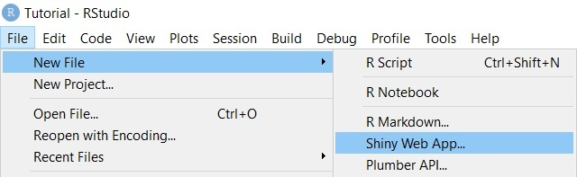
```

|
Po zainstalowaniu wymaganych bibliotek można utworzyć nową aplikację Shiny, rozpoczynając kodowanie w istniejącym pustym pliku R, lub przechodząc do opcji *File > New File > Shiny Web App...*, aby utworzyć nowy plik.

|
```{r fig.align="center", fig.show="hold",out.width = '70%', fig.cap = "okno wyskakujące podczas tworzenia nowego pliku", echo=FALSE}
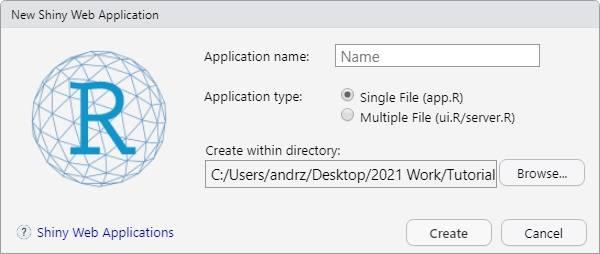
```
|

Jeśli zdecydujesz się utworzyć nowy plik za pomocą *Shiny Web App...*, najpierw zostaniesz zapytany, gdzie chcesz utworzyć aplikację i czy w jednym, czy w dwóch skryptach R. Jeżeli chodzi o podział jeden/dwa pliki, to zostanie to wyjaśnione na początku tego samouczka; na razie sugeruję zacząć od jednego pliku. Po wybraniu opcji, nazwaniu nowej aplikacji i określeniu jej lokalizacji, zostanie utworzony nowy skrypt R. Będzie zawierał przykładowy kod bardzo prostej, przykładowej aplikacji, który można całkowicie usunąć, lub użyć go jako bazę do dalszej pracy.


\pagebreak
\begin{center}
\rule{1\textwidth}{.4pt}
\end{center}

|

```{r fig.align="center", fig.show="hold",out.width = '60%',fig.cap = "Zmiany w pasku powyżej wyświetlanego skryptu", echo=FALSE}
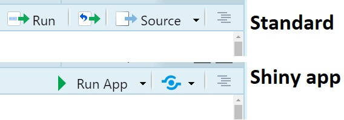
```

|

W przypadku rozpoczęcia pracy z całkowicie pustym plikiem R, opcje wyświetlania pliku będą początkowo takie same, jak w przypadku każdego innego pliku skryptu R. Jednak po uwzględnieniu kluczowych funkcji aplikacji Shiny (wyjaśnionych w dalszej części samouczka) i zapisaniu pliku, RStudio zaktualizuje odpowiednie opcje w prawym górnym rogu wyświetlanego pliku. Przycisk „Uruchom” zmieni się w przycisk „Uruchom aplikację”. Wyniki działania aplikacji, zamiast zapisania w środowisku, zostaną wyświetlone w osobnym oknie (RStudio symuluje środowisko serwera WWW).

Dodatkowo wyświetlony zostanie również przycisk „opublikuj aplikację bądź dokument” (niebieski znak „oczka”). Umożliwia on publikowanie wyników Twojej pracy bezpośrednio w dedykowanych repozytoriach lub serwerach, o ile uprzednio skonfigurowałeś RStudio do pracy z nimi.


|

```{r fig.align="center", fig.show="hold",out.width = '70%',fig.cap = "RStudio symulujące środowisko serwerowe dla aplikacji Shiny", echo=FALSE}
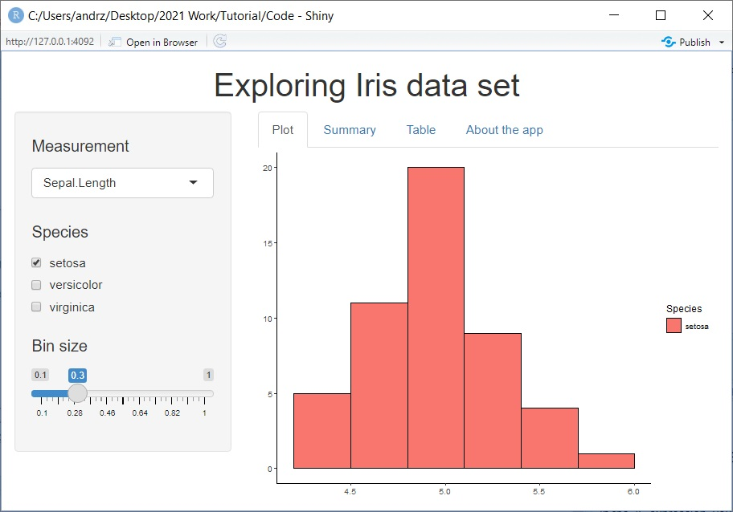
```

\pagebreak
\begin{center}
\rule{1\textwidth}{.4pt}
\end{center}

## Jak działają aplikacje internetowe? {#howappswork}

|
```{r fig.align="center", fig.show="hold",out.width = '80%',  fig.cap = "Uproszczona struktura aplikacji internetowej", echo=FALSE}
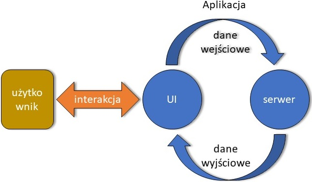
```

|
 
Mimo że aplikacje internetowe mają różne kształty i formy, podstawowa struktura pozostaje taka sama.

To, co my, użytkownicy, widzimy podczas uruchamiania aplikacji, nazywa się interfejsem użytkownika (ang. *User Interface*, w skrócie UI). Zapewnia on użytkownikowi możliwość interakcji z aplikacją. Przede wszystkim gromadzi dane wejściowe ( za pomocą naciśniętych przycisków lub tekstu pisanego) i wyświetla wyniki uzyskanie na bazie tych danych, takie jak tabele lub wykresy. Obecnie najczęściej korzystamy z graficznego interfejsu użytkownika (GUI), ale istnieje wiele różnych podejść do interakcji użytkownika z aplikacją, od wyświetlania wierszy poleceń po wykorzystanie m.in. dźwięku (głosowy interfejs użytkownika, rozwiązanie dedykowane niedowidzącym). Interfejs użytkownika można również rozumieć jako "przód"(*front-end*) aplikacji - *front-end programmer* to programiści zajmujący się specyficznie tą stroną aplikacji.

Jednak generowanie danych wyjściowych nie odbywa się w interfejsie użytkownika, ale po stronie serwera, „zaplecza" (*back-end*) aplikacji. Tutaj wszystkie żądania są przetwarzane zgodnie z zakodowanymi poleceniami, przy użyciu plików (np. zbiorów danych) zawartych już w aplikacji bądź dostarczonych przez użytkownika. Utworzone dane wyjściowe są następnie przekazywane z powrotem do interfejsu użytkownika w celu przekazania użytkownikowi. Gdy aplikacja jest uruchomiona, interfejs użytkownika i serwer stale komunikują się ze sobą. Za każdym razem, gdy dane wejściowe zmieniają się, serwer ponownie oblicza dane wyjściowe, a następnie wyświetla dane wyjściowe aktualizujące interfejs użytkownika.

\pagebreak
\begin{center}
\rule{1\textwidth}{.4pt}
\end{center}

## Shiny: struktura aplikacji {#appstructure}

|
| 

Bazowy układ aplikacji Shiny jest zgodny z wcześniej przedstawioną strukturą właściwej aplikacji internetowej. Elementy interfejsu użytkownika, takie jak ogólny układ, interaktywne elementy (np. przyciski, pasek przewijania, pola do wprowadzanie tekstu) i obszary do wyświetlania danych wyjściowych (np. wykresów bądź tabel), są zdefiniowane w funkcji *fluidPage()*. 

Strona serwerowa aplikacji, gdzie odbywa się właściwa kalkulacja wyników, jest luźniej definiowana w ogólnym kodzie i dopiero aktywnie definiowana pomiędzy {} podczas kodowania właściwej analizy w R. Nie zmienia to jednak faktu, że kod musi bazować na wewnętrznej logice aplikacji. W *function(input, output, session) {}* dwa kluczowe elementy to *input* (dane wejściowe) i *output* (dane wyjściowe) jako predefiniowane argumenty, a specyficznie obiekty zawierające wszystkie dane wejściowe przekazane serwerowi (*input*) oraz wyniki kalkulacji (*output*), przekazywanie później interfejsowi użytkownika do wyświetlenia.

Funkcją łączącą elementy interfejsu użytkownika i serwera w funkcjonalną całość jest *shinyApp()*, która wymaga dwóch kluczowych argumentów, nazwanych *UI* i *server*.

Ponieważ Shiny obsługuje kod CSS, każda aplikacja napisana w języku R będzie mogła automatycznie dostosowywać się i zmieniać rozmiar, aby pasowała do różnych wyświetlaczy (np. komputera bądź telefonu).

|
```{r eval=FALSE, echo=TRUE}
#Standardowa struktura Shiny
  ui <- fluidPage()                    #Pomiędzy () zdefiniowanie struktury
                                       #UI za pomocą odpowiednich funkcji
  server <- function(input, output) {} #Pomiędzy {} kod R zagnieżdżony w
                                       #specjalnych funkcjach
  shinyApp(ui = ui, server = server) 
 
#Jest możliwe zdefiniowanie elementów aplikacji
#jako funkcje zagnieżdżone w funkcji shinyApp()
shinyApp(
  ui = fluidPage(),
  server = function(input, output) {}
) 
#Dla ułatwienia pracy z innymi elementami Shiny upewnij się, że
#podczas zapisywania plik nosi nazwę app.R

#UI i serwer mogą być osobnymi plikami o nazwach ui.R i server.R
#Muszą być w tym samym folderze i wczytywać te same biblioteki
#Aplikację taką można uruchomić jakby była związana przez shinyApp()

```

\pagebreak
\begin{center}
\rule{1\textwidth}{.4pt}
\end{center}

## Shiny: interfejs użytkownika {#designinglayout}
|
| 

```{r fig.align="center", fig.show="hold",out.width = '75%',  fig.cap = "Po lewej - shemat układu z panelem bocznym; Po prawej - sformułowanie tego układu poprzez zagnieżdżanie odpowiednich elementów kodu", echo=FALSE}
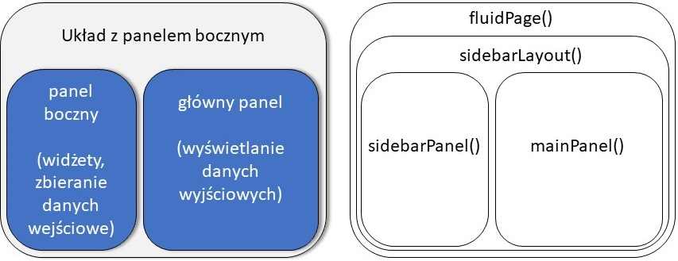
```

|

Kodowanie struktury interfejsu użytkownika jest z zasady podejściem dwuetapowym. Najpierw definiujemy ogólną strukturę układu, zagnieżdżając określoną funkcję w *fluidPage()*. Najprostszym, domyślnym układem jest aplikacja z paskiem bocznym: *sidebarLayout()*. Układ ten zawiera dwa obszary (panele): panel główny, przeznaczony do wyświetlania wyników, oraz panel boczny, na elementy niezbędne do zbierania danych od użytkownika (o czym, w detalach, opowiemy później). Lokalizacja paska bocznego jest zdefiniowana przez argument *position*, który domyślnie jest przypisany jako *position = "left"*. Oba panele są zagnieżdżone w funkcji układu za pomocą funkcji *sidebarPanel()* i *mainPanel()*.

|
```{r eval=FALSE, echo=TRUE}
#Standardowy układ
  ui <- fluidPage(
    sidebarLayout(     
      sidebarPanel(),
      mainPanel()
      )
    )

#--//--, pasek boczny zdefiniowany z prawej strony
  ui <- fluidPage(
    sidebarLayout(
      position = "right",     
      sidebarPanel(),
      mainPanel()
      )
    )
```

\pagebreak
\begin{center}
\rule{1\textwidth}{.4pt}
\end{center}

|

Istnieją inne układy i typy paneli, które można wykorzystać podczas projektowania własnej aplikacji. Na przykład *flowLayout()* i *verticalLayout()* umożliwiają tworzenie aplikacji z wieloma panelami. Aby uzyskać jeszcze większą swobodę, *fluidRow()* i *fixedRow()* umożliwiają kodowanie w układzie siatki i dopasowywanie paneli w określonej pozycji. Wśród bardziej popularnych funkcji definiujących panele, *titlePanel()* i *headerPanel()* mogą być przydatne, jeśli chcemy wyświetlić nazwę aplikacji. Mogą też być zagnieżdżone przed ustaleniem właściwego układu. Alternatywą dla paska bocznego (tzn. panel dla zbierania danych wejściowych) może być *inputPanel()* lub *wellPanel()*. Technicznie, nowe elementy (np. przycisk bd) można dołączyć bez deklarowania utworzenia nowego panelu, dobrą praktyką jest jednak zebranie ich razem, najlepiej w tym samym panelu. Zobacz [tutaj](https://bookdown.org/weicheng/shinyTutorial/ui.html#layout) ,lub [tutaj](https://shiny.rstudio.com/articles/layout-guide.html), aby uzyskać dalsze wyjaśnienia i przykłady projektowania układu i zagnieżdżania w wymaganych panelach.


```{r fig.align="center", fig.show="hold",out.width = '75%', fig.cap = "Po lewej - schemat układu składającego się z trzech zakładek; Po prawej - sformułowanie tego układu poprzez zagnieżdżanie odpowiednich elementów kodu", echo=FALSE}
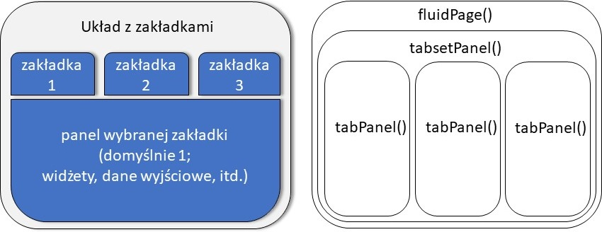
```

|
Układ aplikacji można zdefiniować tylko za pomocą funkcji panelu, zwłaszcza jeśli zagnieżdżamy je w sobie. Na przykład *tabsetPanel()* jest główną funkcją do tworzenia i wyświetlania kart, a funkcja panelu *tabPanel()* służy do tworzenia określonych kart. Zobacz kod poniżej dla funkcjonalnego przykładu:

|

```{r eval=FALSE, echo=TRUE}
#Układ zakładek, oparty na zagnieżdżonych panelach
  ui <- fluidPage(
    titlePanel(
    h1("tabset layout",   # Tytuł aplikacji
       align = "center")  # (rozmiar tytułu,tu h1, oraz położenie)
    ),
    tabsetPanel(          #Panel/układ z zakładkami
      tabPanel("tab1"),   #Zakładka/panel #1
      tabPanel("tab2"),   #Zakładka/panel #2
      tabPanel("tab3")    #Zakładka/panel #3
    ))
#NavlistPanel() również działałby zamiast tabsetPanel()
#z zakładkami wyświetlanymi jako pasek boczny
```

\pagebreak
\begin{center}
\rule{1\textwidth}{.4pt}
\end{center}


## Shiny: estetyka z Shinythemes {#customization}


|
```{r fig.align="center", fig.show="hold",out.width = '90%', fig.cap = "Aplikacja z aktywnym selektorem motywów", echo=FALSE}
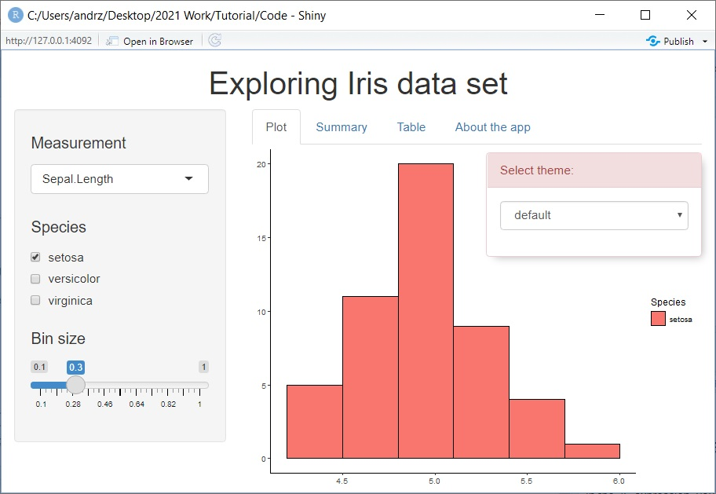
```

| 
Jednym z łatwych sposobów dalszego dostosowywania estetyki aplikacji Shiny, bez wchodzenia w szczegóły kodowania w CSS, jest użycie biblioteki *shinythemes*. Zawiera ona ponad 15 różnych motywów, zmieniających paletę kolorów układu, rodzaj i rozmiar czcionki oraz drobne elementy stylistyczne (np. różnie wyglądające przyciski/pola wyboru). Aby użyć konkretnego motywu, wystarczy umieścić argument *shinytheme()* w funkcji *fluidpage()* z zawartą w nim nazwą motywu. Jeśli nie masz pewności, którego motywu użyć, możesz zamiast tego dołączyć *themeSelector()* jako argument, co spowoduje wyświetlenie wyskakującego okienka ze wszystkimi motywami obecnymi po uruchomieniu. Więcej informacji o tej bibliotece można znaleźć [tutaj](https://rstudio.github.io/shinythemes/).

| 
```{r eval=FALSE, echo=TRUE}
#Wczytanie odpowiedniej biblioteki
library(shinythemes)

ui <- fluidPage(
  theme = shinytheme("yeti"), #Wczytanie odpowiedniego motywu
  themeSelector()             #Selektor motywów, wyświetlony w aplikacji
  )
```

\pagebreak
\begin{center}
\rule{1\textwidth}{.4pt}
\end{center}


## Shiny: pisanie w aplikacji {#customization2}

```{r fig.align="center", fig.show="hold",out.width = '100%', fig.cap = "Przykłady tekstu wyświetlanego w aplikacji", echo=FALSE}
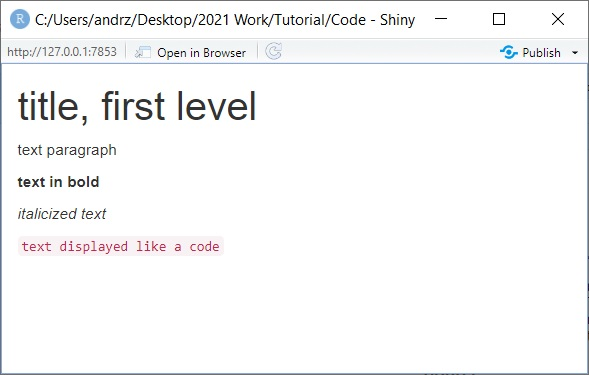
```

| 
Czasami możesz chcieć umieścić tekst pisany w samej aplikacji, na przykład wyjaśnić cel aplikacji, bądź opisać, jak z niej prawidłowo korzystać.

Można to łatwo zrobić za pomocą kilku różnych funkcji, omówionych [tutaj](https://shiny.rstudio.com/tutorial/written-tutorial/lesson2/). Ich nazwy nawiązują do funkcji w kodzie HTML. Podstawową funkcją  do osadzania prostych akapitów tekstu jest *p()*. W przypadku chęci osadzenia pogrubionego tekstu, można wykorzystać *strong()*, natomiast w przypadku kursywy *em()*. Jeśli ktoś chce wyświetlić tekst wejściowy tak, jak zostałby wyświetlony kod, można użyć *code()*. Inne często używane funkcje to *h1()* do *h4()*, powszechnie używane do tworzenia tytułów o różnych rozmiarach.

Tekst można osadzić na dowolnym poziomie interfejsu użytkownika. Możliwe jest m.in. osadzenie tekstu w *h1()* jako nazwy aplikacji bezpośrednio w funkcji fluidPage(). Generalnie jednak dla dłuższego tekstu pisanego sugeruję stworzenie dedykowanego panelu, dla lepszej czytelności.

| 
```{r eval=FALSE, echo=TRUE}
#Pisanie w aplikacji, przykłady
ui <- fluidPage(
  h1("tytuł"),
  p("tekst, normalny"),
  strong("tekst, pogrubiony"),
  em("tekst, kursywa"),
  code("text, jak kod")
  )
```

\pagebreak
\begin{center}
\rule{1\textwidth}{.4pt}
\end{center}

## Shiny: uzyskiwanie danych wejściowych {#gettinginput}
|
```{r fig.align="center", fig.show="hold",out.width = '100%', fig.cap = "Side panel with widget examples embedded", echo=FALSE}
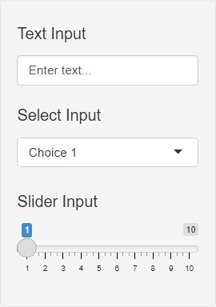
```

|
Widżety to zasadniczo elementy interaktywne każdej aplikacji, takie jak np. okienka czy przyciski. W przypadku Shiny, nazwa odnosi się specyficznie do elementów uzyskujących danej wejściowe od użytkownika. Mogą to być przyciski, suwaki czy pola wyboru, ale także pola do wpisania odpowiedzi użytkownika, a nawet wgrania własnych dokumentów. Lista podstawowych widżetów dostępna jest [tutaj] (https://shiny.rstudio.com/gallery/widget-gallery.html), wraz z powiązanym kodem [tutaj] (https://shiny.rstudio.com/tutorial/written-tutorial/lesson3/). Lista niestandardowych widżetów z biblioteki *shinyWidgets* jest dostępna [tutaj] (http://shinyapps.dreamrs.fr/shinyWidgets/).

O ile możliwe argumenty do zdefiniowania różnią się między dostępnymi widżetami, wszystkie zaczynają się od argumentu określającego nazwę obiektu, który będzie przechowywał dane wejściowe (w przypadku funkcji bibliotecznych Shiny pod nazwą *inputId*), z możliwością zdefiniowania wyświetlanej nazwy widżetu pod argumentem *label*. W przypadku niektórych widżetów do poprawnego działania wystarczy zdefiniowanie tylko tych dwóch argumentów (np. *textInput*), podczas gdy inne wymagają dodatkowych informacji, na przykład dostępnych opcji lub wstępnie wybranej/domyślnej odpowiedzi (zwykle *value* lub *selected*).

Dobrą praktyką przy dodawaniu widżetów i definiowaniu ich parametrów jest robienie tego z myślą o czytelności i porządku. Wszystkie widżety należy odpowiednio nazwać, aby wyraźnie przekazać użytkownikowi ich użyteczność. Przy układaniu warto pamiętać, aby ustawić je w kolejności malejącej, tj. od wejścia kluczowego (np. definicja, jakie dane mają być przetwarzane) do wejścia definiującego drobne szczegóły (np. specyfika formatowania wykresów danych lub tabel).

\pagebreak
\begin{center}
\rule{1\textwidth}{.4pt}
\end{center}

| 
```{r eval=FALSE, echo=TRUE}
#Przykłady widżetów
  ui <- fluidPage(
    sidebarLayout(
      sidebarPanel(
        textInput(                    # Widżet, pole do wpisania tekstu
          inputId = "InputName1",     # Nazwa obiektu (zapis danych)
          label = h4("Text Input"),   # Nazwa (wyświetlona nad widżetem)
          value = "Enter text...")    # Domyślna odpowiedź
      ,
      selectInput(                    # Widżet, pola wyboru
          inputId = "InputName2",     # Nazwa obiektu (zapis danych)
          label = h4("Select Input"), # Nazwa (wyświetlona nad widżetem)
          choices = list(             # Określone pola do wyboru
            "Choice 1" = 1,
            "Choice 2" = 2), 
          selected = 1)               # Domyślna odpowiedź      
      ,  
      sliderInput(                    # Widżet, slajder z zakresem wartości
          inputId = "InputName3",     # Nazwa obiektu (zapis danych)
          label = h4("Slider Input"), # Nazwa (wyświetlona nad widżetem)
          min = 1,                    # Wartość minimalna
          max = 10,                   # Wartość maksymalna
          value = 1)                  # Domyślna odpowiedź
        ),
      mainPanel()
      )
    )
```

\pagebreak
\begin{center}
\rule{1\textwidth}{.4pt}
\end{center}

| 
Co zrobić, jeśli jakiś widżet jest potrzebny tylko w przypadku specyficznego wyboru w innym widżetcie?

Jeśli chcesz, aby niektóre opcje pozostały ukryte, dopóki nie wystąpią określone warunki, możesz użyć funkcji *conditionalPanel()* do ustalenia panelu warunkowego. Dwa kluczowe argumenty do uwzględnienia to *warunek*, przy którym pojawi się dodatkowy widżet, oraz sam widżet. Na przykład *conditon = ("input.InputName = 2")* mówi nam, że obiekt z określonymi danymi uzyskanymi od użytkownika (nazwane *InputName*) musi musi równać się numerycznej 2, by dodatkowy widżet się  pojawił. Należy jednak pamiętać, że warunki są oceniane zgodnie z kodowaniem JavaScript, a nie R (np. *=* jako znak równości, kiedy *==* jest domyśnym znakiem tego typu w R). Dlatego też warunek pojawia się w cudzysłowiu.

| 
```{r eval=FALSE, echo=TRUE}
#Przykład użycia panelu warunkowego
  ui <- fluidPage(
    sidebarLayout(
      sidebarPanel(
      selectInput(                   #Widżet, do którego nawiązuje                    
          inputId = "InputName",     #panel warunkowy
          label = h4("Select Input"), 
          choices = list(           
            "Choice 1" = 1,
            "Choice 2" = 2), 
          selected = 1)              
      ,  
      conditonalPanel(               #Panel warunkowy
          conditon = (               #Ustalenie warunku dla którego
            "input.InputName = 2"    #pojawia się dodatkowy widżet
            ),                       
          sliderInput(               #Widżet pojawi się w panelu bocznym     
          inputId = "CondInput",     #jeżeli warunek jest spełniony
          label = h4("Conditonal Input"),
          min = 1,                  
          max = 10,                  
          value = 1)
      )                
      ),
      mainPanel()
      )
    )
```

\pagebreak
\begin{center}
\rule{1\textwidth}{.4pt}
\end{center}

## Shiny: serwer i kalkulowanie danych wyjściowych {#renderingoutput}

|
| 

Jak już było omówione w [*Shiny: struktura aplikacji*](#appstructure), każda zdefiniowana funkcja serwera musi zawierać dwa elementy, jeden do uzyskania danych wejściowych z interfejsu użytkownika, zwany po prostu *input*, drugi używany do przechowywania wszystkich renderowanych obiektów, o nazwie *output*. W rzeczywistości istnieje trzeci możliwy argument, zwany *server*, ale jest on wymagany do dodatkowego zdefiniowania relacji serweru z UI; całkowicie niepotrzebny przy pisaniu prostszych aplikacji.

| 
Nawiasy {} zawierają cały kod języka R definiujący wewnętrzną logikę aplikacji, dodatkowo wpisany w funkcje służące do przechwytywania („renderowania”) i zapisu wyników tej pracy. Na przykład funkcja *renderPlot()* będzie w stanie przechwycić grafikę stworzoną np. dzięki bibliotece ggplot. *renderTable()* przechwyci większość formatów tabel, przy czym *renderDataTable()* jest zaawansowaną funkcją, dla bardziej interaktywnych wyników. Wydruki z konsoli, takie jak dostarczone przez m.in. funkcję *summary()*, mogą być uchycone przez *renderPrint()*, podczas gdy zwykłe wyniki tekstowe będzie łatwo zapisać dzięki funkcji *renderText()*. Warto jednak zauważyć, że w przypadku tekstu bądź druku z konsoli wyrażenie w R musi być dodatkowo umieszczone w nawiasach {}, np. *renderPrint({"Wyrażenie_do_oceny"})*. W ramach podstawowej biblioteki *Shiny* znajduje się funkcja renderująca obrazy (*renderImage()*; obrazy mogą być wczytane przez użytkownika, ściągnięte z zewnętrznej strony internetowej poprzez URL, lub przechowywane na serwerze, a nawet elementy interfejsu użytkownika (*renderUI()*).

| 
Konkretne dane wejściowe są wydzielane z ogólnego obiektu *input* za pomocą znaku (operatora) dolara i ustalonej nazwy dla specyficznych danych, w podobny sposób jak np. wydziela się konkretne kolumny ze zbioru  danych. Na przykład, jeśli dane przy wprowadzaniu tekstu zostały zdefiniowane jako *textInput1*, można je wydzielić na poziomie serwera za pomocą *input$textInput1*.

|
Aby funkcja renderująca dane poprawnie przekazywała je jako czytelne dane wyjściowe serwera, musi on zostać zapisany jako część obiektu *output*. Wystarczy przypisać go do *output* pod konkretną nazwą (id), np. "*output$Plot*".

|
Zapisane dane wejściowe mogą mieć różne formaty, o czym należy pamiętać podczas pisania kodu serwera. Zwykle dane wejściowe to dane liczbowe (np. *1*) lub tekstowe (np. *"1"*) i są definiowane podczas tworzenia widżetu. Widżety mogą jednak używać także innych formatów danych, takich jak tabele czy obrazy z geometrią 2/3D.

\pagebreak
\begin{center}
\rule{1\textwidth}{.4pt}
\end{center}

|
Jak to działa w przypadku całego kodu?

Załóżmy, że chcemy wyrenderować prosty histogram na podstawie dowolnego pomiaru wybranego przez użytkownika spośród wszystkich dostępnych w zestawie danych Iris (patrz kod poniżej). Najpierw tworzymy widżet pozwalający na wybór tego pomiaru. *Measurements* zapisuje wybór użytkownika jako dane tekstowe i w takiej formie przekazuje je do obiektu, gdzie dane wejściowe są przechowywane. Po stronie serwera używamy *renderPlot()*, aby przechwycić histogram wygenerowany przez funkcję *ggplot()*, i zapisujemy jako *output$resultPlot*. W równaniu *ggplot()* używamy bazy danych *iris*, a oczekiwaną geometrię do wygenerowania zapewnia *geom_histogram()*. W *aes()* jako x wstawiamy *iris[[input$Measurements]]* - inaczej mówiąc, wybieramy kolumnę o nazwie *input$Measurements*. Jako, że dane wejściowe są zdefiniowane jako tekst, tak napisany kod powinien pozwolić na wybranie z bazy danych kolumny o pożądanej nazwie. 

|
```{r eval=FALSE, echo=TRUE}
#Przykad pokazujący tak strukturę widżetu w UI jak i
#powiązane środowisko serwerowe. Zestaw danych iris jako przykład
  ui <- fluidPage(
    sidebarLayout( 
      sidebarPanel(
        selectInput(                        #Widżet pozwalający na wybór 
                                            #odpowiedzi (tu pola wyboru)
          inputId = "Measurements",         #Nazwa obiektu (zapis danych)
          label = h4("Measurement"),
          choices = list(                   #Lista kolumn w iris
            "Sepal.Length" = "Sepal.Length",#(wartości równe nazwom kolumn, 
            "Sepal.Width"  = "Sepal.Width", #co oznacza, że dane tekstowe 
            "Petal.Length" = "Petal.Length",#są przekazywane dalej)
            "Petal.Width"  = "Petal.Width"),#Domyślny pierwszy wybór
          selected = "Sepal.Length"
 ))))

 server <- function(input, output) {
  
  output$resultPlot  <- renderPlot(         #Renderowanie wyniku (wykresu)
    ggplot(iris,                            #Źródłem baza danych iris
           aes(                             #By wygenerować geometrię
      x=iris[[input$Measurements]]          #przekazujemy dane wejściowe z
      )) + geom_histogram()                 #widżetu, zagnieżdżone tak, by
  )                                         #działać jako nazwa kolmny
  
  }
```

\pagebreak
\begin{center}
\rule{1\textwidth}{.4pt}
\end{center}

| 
Co zrobić, jeśli serwer ma przekazywać informacje wewnątrz siebie?

Kluczową praktyką w kodowaniu jest ograniczenie do minimum powtarzalności kodu. Po co powtarzać te same kalkulacje, dodatkowo obciążając program zbędnymi danymi, jeżeli można tylko raz wykalkulować dane i użyć ich tam, gdzie są potrzebne? W R nie stanowi to dużego problemu, ale w architekturze serwerowej aplikacji Shiny jest do tego potrzebna oddzielna funkcja, zwana *reactive()*. Tworzy ona obiekt do wykorzystania tylko w obrębie serwera, możliwy do użycia tak wewnątrz funkcji renderujących specyficzne wyniki, jak i w innych reaktywnych elementach kodu. Podobnie jak w niektórych innych funkcjach, kod, który ma zostać obliczony, umieszczamy w nawiasach {}, np. *reactive({/kod_tutaj/})*.


```{r eval=FALSE, echo=TRUE}
#Przykład użycia funcji reactive(), używając bazy danych Iris
  ui <- fluidPage(
    sidebarLayout( 
      sidebarPanel(
        selectInput(                         
          inputId = "Measurements",            
          label = h4("Measurement"),
          choices = list(                     
            "Sepal.Length" = "Sepal.Length",  
            "Sepal.Width"  = "Sepal.Width",
            "Petal.Length" = "Petal.Length",
            "Petal.Width"  = "Petal.Width"),  
          selected = "Sepal.Length"
))))

  server <- function(input, output) {
    dataReactive <- reactive({           #Używamy reactive() by wygenerować
      subset(iris,                       #bazę danych zawierających tylko   
             select = c(                      
               input$Measurements,       #wymagany pomiar i
               "Species"                 #kolumnę z gatunkami
    ))})
    output$resultPlot  <- renderPlot(           
     ggplot(dataReactive(),              #Wywołanie obiektu reaktywnego            
             aes(                        #(w tym wypadku tabeli danych)
               x=dataReactive()[,1]      #Pierwsza kolumna (pomiar) jako x    
             )) + geom_histogram()            
    )  
    output$resultPrint <- renderPrint( 
      {summary(dataReactive())}       #Ponowne wywołanie obiektu reaktywnego
    )}
```


\pagebreak
\begin{center}
\rule{1\textwidth}{.4pt}
\end{center}

## Shiny: wyświetlanie danych wyjściowych {#displayingoutput}

|
|
Wyświetlanie danych wyjściowych w interfejsie użytkownika jest prawdopodobnie najłatwiejszą częścią tworzenia aplikacji poprzez bibliotekę Shiny.


Podobnie jak w przypadku renderowania wyników po stronie serwera, wyświetlanie ich jako części interfejsu użytkownika wymaga dedykowanych funkcji. *plotOutput()* służy do wyświetlania wykresów, *tableOutput()* i *dataTableOutput()* są używane do wyświetlania tabel (przy czym druga zapewnia większą interaktywność), *textOutput()* i *verbatimTextOutput()* wyświetlają tekst, *htmlOutput()* i *uiOutput()* wyświetlają kod HTML, *imageOutput()* wyświetla obrazy. Te funkcje muszą mieć podaną nazwę danych wyjściowych do wyświetlenia, zdefiniowaną w nawiasach. Po zagnieżdżeniu w elementach układu UI, przypisaniu danych wyjściowych i uruchomieniu aplikacji funkcje powinny działać zgodnie z oczekiwaniami.

| 
```{r eval=FALSE, echo=TRUE}
#Trzy przykłady funkcji pokazujących dane wyjściowe, 
#zagnieżdżony w UI składającym się z zestawu zakładek

 ui <- fluidPage(
    sidebarLayout(
      sidebarPanel(),
      mainPanel(
        tabsetPanel(
          tabPanel("Plot",                #...wyświetlanie geometrii
                   plotOutput(
                     "resultPlot")) ,         
          tabPanel("Print",               #...wyświetlanie tekstu/druku
                   verbatimTextOutput(
                     "resultPrint")), 
          tabPanel("Table",               #...wyświetlanie tabeli danych
                   dataTableOutput(
                     'resultTable'))     
       ))
      )
    )  
```

\pagebreak
\begin{center}
\rule{1\textwidth}{.4pt}
\end{center}

## Shiny: przykład działającej aplikacji {#functionalexample}  

|
| 
Jak wygląda ostateczna aplikacja, gdy połączymy wszystkie jej elementy w funkcjonalną całość? I jak przebiega proces projektowania aplikacji, od ogólnego pomysłu po szczegółowy plan?

Przykładowy kod aplikacji można znaleźć spisany poniżej, pod koniec rozdziału, a także załadować do RStudio ze strony Github, wpisując *shiny::runGitHub("ShinySamouczek", "AndrzejRomaniuk", ref = "main", subdir = "appexample")* w konsoli.

|
|
*Aplikacja do eksploracji danych z bazy Iris: pomysł, układ i wykonanie*

|
Napisaniu tej aplikacji przyświecała potrzeba zbadania rozkładu danych w przykładowej bazie danych, przy jednoczesnej kontroli and tym, jakie dane będą uwzględnione i w jaki sposób będą podane wyniki.

Ale jak to osiągnąć? Wszystkie wymiary podane są w cm z jedną wartością dziesiętną. Wizualnie analizę można najprościej przeprowadzić tworząc histogram, używając do tego celu bibliotekę *ggplot*. Z kolei podstawowe statystyki opisowe dla danych liczbowych można łatwo uzyskać za pomocą funkcji *summary()*. Co więcej, korzystne byłoby również wyświetlenie przy okazji tabeli danych ze wszystkimi aktualnie używanymi pomiarami. W takim przypadku możemy użyć biblioteki *DT*, aby uzyskać interaktywną tabelę danych zawierającą podstawowe funkcje sortowania.

Gdy już wiemy, co chcemy zrobić, czas przejść do projektowania układu interfejsu użytkownika. Biorąc pod uwagę, że cel aplikacji jest stosunkowo prosty, standardowy układ paska bocznego wydaje się więcej niż wystarczający. Wszystkie widżety można zebrać w panelu bocznym, a wyniki można wyświetlić w panelu głównym. Aby upewnić się, że mamy wystarczająco dużo miejsca w panelu głównym, możemy dołączyć funkcję *tabsetPanel()* z kilkoma panelami zakładek dla danych wyjściowych. Zdefiniowane zakładki to „Wykres” dla histogramu, „Podsumowanie” dla statystyk opisowych, „Tabela” dla tabeli z aktualnie używanymi pomiarami i być może „O aplikacji”, aby zapisać wszelkie informacje przydatne dla użytkownika. Aby uzyskać nieco inne wrażenia estetyczne, możemy zagnieździć *shinytheme("yeti")* w *fluidPage()*.

Następnie widżety. Należy je umieścić w panelu bocznym i uporządkować według malejącego znaczenia. Kluczową kwestią, wyborem pomiaru do zbadania, może zająć się widżet *selectInput()*. Cztery pomiary, jako cztery dostępne odpowiedzi przez ten widżet, byłyby  pierwszym możliwym wyborem w panelu bocznym. Kolejną kwestią będzie, które gatunki należy uwzględnić przy analizie pomiarów. Można to rozwiązać za pomocą funkcji *checkboxGroupInput()*, definiując pole wyboru dla każdego możliwego gatunku. Jeśli jednak się nad tym zastanowimy, jeśli będziemy badać pomiary więcej niż jednego gatunku, możemy albo analizować wszystkie jako jedną grupę, albo jako osobne grupy. Tak więc poniżej pól wyboru gatunków może pojawić się inne, warunkowe pole wyboru (i.e. zagnieżdżone w *conditonalPanel()*), używające widżetu *checkboxInput()* i pojawiąjące się, jeśli użytkownik zaznaczył więcej niż jeden gatunek. Domyślnie wszystkie gatunki byłyby analizowane łącznie, ale wyskakujące okienko może zostać odznaczone, by analizować je oddzielnie. Ponieważ czytelność wykresu histogramu zależy od użytego rozmiaru kosza (np. słupków z którego się składa histogram), a pomiary z bazy danych różnią się na tyle, że jeden rozmiar może nie być wystarczającym źródłem informacji we wszystkich przypadkach, jako ostatni widget możemy dodać suwak wejściowy *sliderInput()*. Byłby on użyty, by dostosować rozmiary koszy. W uzyskanych zestawach danych wejściowych dwa byłyby danymi tekstowymi (pomiary i gatunki), jeden byłby wartością logiczną (wybór z pola wyboru), a ostatni dyskutowany wartością liczbową (rozmiar kosza).

Strona serwerowa tej aplikacji powinna zawierać trzy opcje renderowania (wykres, statystyka opisowa i tabela). We wszystkich trzech przypadkach wykorzystywane byłyby te same dane, co oznacza, że należy je zdefiniować jako oddzielny podzbiór, by uniknąć powtarzania kodu, za pomocą funkcji *reactive()*. Wewnątrz funkcji trzeba byłoby zdefiniować podzbiór z generalnego zbioru Iris poprzez funkcję *subset()* oraz dane wejściowe związane z wybranymi  pomiarami i gatunkami. Dane zapisane ostatecznie jako *dataReactive()* mogą być dalej przekazane do funkcji renderujących histogram (*renderPlot()*), statystyki opisowe (*renderPrint()*) lub bezpośrednio jako dane wyjściowe ((*renderDataTable()*). Podczas definiowania histogramu w *renderPlot()* użyte byłyby także dane wejściowe dotyczące rozmiaru kosza jak i ewentualnego wyboru, w jaki sposób analizować wiele gatunków. W przypadku *renderPrint()*, oprócz *dataReactive()*, używalibyśmy tylko wyboru dotyczącego gatunków. Po zakończeniu renderowania, dane wyjściowe są wyświetlane w predefiniowanych zakładkach graficznego interfejsu.

|
|
*Aplikacja do eksploracji danych z bazy Iris: kod wraz z komentarzem*

| 
```{r eval=FALSE, echo=TRUE}
#Wczytywnanie wymaganych bibliotek
library(ggplot2)
library(shiny)
library(DT)
library(shinythemes)

#Interfejs Użytkownika (standardowy układ z paskiem bocznym)
ui <- fluidPage(
  theme = shinytheme("yeti"),           #Wybrany motyw (bibl. shinythemes)
  h1("Exploring Iris data set",         #Tytuł aplikacji,
     align = "center"),                 #wyrównany do środka
  sidebarLayout(                        #Układ z paskiem bocznym
    sidebarPanel(                       #Pasek boczny z możliwością
      selectInput(                      #wyboru danych wejściowych  
        inputId = "Measurements",       #Najpierw dajemy użytkownikowi wybór 
        label = h4("Measurement"),      #co dokładnie chce przeanalizować
        choices = list(                 #(lista pomiarów do wyboru)
          "Sepal.Length" = "Sepal.Length", 
          "Sepal.Width"  = "Sepal.Width",
          "Petal.Length" = "Petal.Length",
          "Petal.Width"  = "Petal.Width"), 
        selected = "Sepal.Length"
      ),
      
      checkboxGroupInput(                 #Po drugie, które gatunki powinny 
        inputId = "Species",              #być wziete pod uwagę
        label = h4("Species"),            #(pole wielokrotnego wyboru)
        choices = list(
          "setosa" = "setosa",
          "versicolor" = "versicolor",
          "virginica" = "virginica"
        ),
        selected = "setosa"
      ),
      
      conditionalPanel(                #Po trzecie, użytkowni precyzuje, czy
        condition = (                  #wszystkie gatunki wybrane
          "input.Species.length > 1"), #analizować razem czy oddzielnie
        checkboxInput(                 #(pojedyńcze pole wyboru, widoczne
        inputId = "Joint",             #tylko gdy wiecej niż jeden gatunek
        label = "Joint Species?",      #jest wybrany w poprzednim punkcie)   
        value = TRUE)),                       
      
      sliderInput(                     #Na końcu, jak duże powinny być kosze 
        inputId = "BinSize",           #w generowanym histogramie
        label = h4("Bin size"),
        min = 0.1,
        max = 1,
        value = 0.3)
    )
    ,
    mainPanel(                          #Panel wyświetląjacy wyniki 
      tabsetPanel(                      #w formie zakładek
        tabPanel(                       #(3 wyniki przewidziane)  
          "Plot", 
          plotOutput(                   #histogram
            "resultPlot")            
        ),
        tabPanel(
          "Summary",   
          verbatimTextOutput(           #podsumowanie pomiarów
            "resultPrint")              #(min/max, kwartyle etc.)
        ),                                    
        tabPanel(
          "Table",  
          dataTableOutput(              #Tablica z oryignalnymi danymi
            'resultTable')              #wybranymi do analizy
        ),
        tabPanel(                       #Zakładka z informacjami o aplikacji
          "About the app",              #(czysto informacyjne, dla 
          p(" "),                       #użytkownika)
          strong("Example of a working Shiny app"),
          p(" "),
          p("This Shiny app was written as an 
             example for the tutorial teaching 
             how to create a Shiny app. It is 
             based on Fisher/Anderson’s Iris data 
             set, enabling interactive exploration
            of the data."),
          p(" "),
          p("To run this app from GitHub 
            locally use either the code below (Eng, with Pl explanation):"),
          code('shiny::runGitHub("ShinySamouczek","AndrzejRomaniuk", 
               ref = "main", subdir = "appexample")'),
          p(" "),
          p("(Eng, original):"),
          code('shiny::runGitHub("ShinyTutorial","DCS-training", 
               ref = "main", subdir = "appexample")'),
          p(" "),
          p("See the link below for Shiny official page:"),
          tags$a(href="https://shiny.rstudio.com/", 
                 "shiny.rstudio.com"),
          p(" "),
          p("See the link below for the tutorial GitHub page (Pl)"),
          tags$a(href="https://github.com/AndrzejRomaniuk/ShinySamouczek", 
                 "github.com/AndrzejRomaniuk/ShinySamouczek"),
          p(" "),          
          p("(ENG)"),
          tags$a(href="https://github.com/DCS-training/ShinyTutorial", 
                 "github.com/DCS-training/ShinyTutorial"),
          p(" "),
          p("App and related tutorial originally created fo CDCS UoE 
            by Andrzej A. Romaniuk, later translated for CAA Poland")
        )
      )
    )
    
  )
)

#Część serwerowa aplikacji (zawierąca kod odpowiedzialny za analizę
#danych, na bazie danych wejsciowych od użytkownika; wyniki zapisane jako
#dane wyjściowe)
server <- function(input,output) {
  
  dataReactive <- reactive({            #Po pierwsze, tworzymy podzbiór                    
    subset(iris,                        #potrzebnych danych z oryginalnego
           Species %in% input$Species,  #zbioru Iris
           select = c(                  #(gatunki wybrane, plus kolumna 
             input$Measurements,        #tekstowa z gatunkami)
             "Species")                    
    )
  })
  
  output$resultPlot <- renderPlot(    #Renderowanie wymaganego histogramu
    ggplot(                           #Przy użyciu biblioteki ggplot
      dataReactive(),                 #z wcześniej przygotowanym podzbiorem
      aes(x=dataReactive()[,1],       #Pomiar wybrany jako X
          fill = Species)             #gatunki jako wypełnienie
    ) +                               #dla lepszej czytelności wykresu
      geom_histogram(                         
        binwidth = input$BinSize,     #wielkość kosza, ustalona przez
        boundary = 0,                 #użytkownika
        colour="black"
      ) + 
      theme_classic() + 
      labs(y=NULL,x=NULL) +
      if (input$Joint == FALSE) {   #Jeżeli użytkownik zaznaczył
        facet_wrap(~Species)        #oddzielną analizę wybranych gatunków
      } else {                      #zamiast jenego wykresu dla wszystkich
      })                            #wygenerowane zostaną 
                                    #oddzielne wykresy dla każdego gatunku
  
  output$resultPrint <- renderPrint(      #Podsumowanie wyników
    if (input$Joint == FALSE) {           #(Jeżeli analizowane oddzielnie)
      for (i in 1:length(input$Species)) {
        print(
          input$Species[i],                #Wydruk oddzielnie...
          row.names = FALSE                
        )
        print(
          summary(
            subset(
              dataReactive(), 
              Species == input$Species[i]  #analizy opisowej dla każdego
            )[,1]                          #gatunku
          ),                               
          row.names = FALSE
        )
      }
    } else {
      {summary(dataReactive())}           #(jeżeli analizowane razem)
    })                                    #Wydruk analizy opisowej
  
  
  output$resultTable <- renderDataTable( #Na końcu, tworzenie tabeli
    dataReactive(),                      #z wcześniej utworzonego podzbioru,
    options = list(dom = 'ltp'),         #dla wglądu przez użytkownika
    rownames= FALSE                      #(interaktywność organiczona)
  )
}

#shinyApp() ostatecznie łączy dwie strony aplikacji w funkjonalną całość
shinyApp(ui = ui, server = server)
```

\pagebreak
\begin{center}
\rule{1\textwidth}{.4pt}
\end{center}

## Udostępnianie/wdrażanie aplikacji {#Publishing}

|
| 
Napisałeś aplikację, co teraz? Cóż, aplikację Shiny można udostępniać (*wdrażać*) albo jako nieskompilowany kod w R, albo jako skompilowaną, właściwą aplikację internetową. W pierwszym przypadku po prostu udostępniamy możliwość pobrania skryptu R i powiązanych danych. Użytkownik musi mieć zainstalowane RStudio i wszystkie wymagane biblioteki, aby uruchomić aplikację lokalnie. W drugim przypadku kompilujemy aplikację, wraz ze wszystkimi zależnościami (wymaganymi plikami i danymi),  w samowystarczalny program, udostępniany potem na serwerze online. Aplikacja działa w pełni na tym serwerze (np. wszystkie kalkulacje), a użytkownik potrzebuje tylko adresu URL, aby uzyskać do niej dostęp.

| 
Ponieważ istnieje wiele sposobów na udostępnianie aplikacji, wskażemy tutaj dwa najczęściej używane podejścia: przez [GitHub](https://github.com/) lub [Shinyapps.io](https://www.shinyapps.io/). Jeśli ktoś jest zainteresowany uruchomieniem własnego serwera, jest to możliwe poprzez dedykowany pakiet  *Shiny Server* (do pobrania [tutaj](https://www.rstudio.com/products/shiny/shiny-server/)). Inne alternatywy wdrażania są dostępne w [*The Shiny AWS Book*](https://business-science.github.io/shiny-production-with-aws-book/).

| 
```{r fig.align="center", fig.show="hold", echo=FALSE, fig.cap = "Przykład repozytorium GitHub", out.width = '90%'}
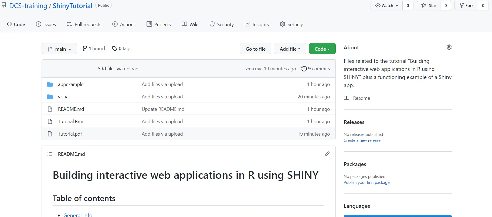
```

| 
*Przykład 1: GitHub*

| 
[GitHub](https://github.com/) (patrz wyżej) to bezpłatne repozytorium, używane głównie przez programistów do przechowywania, udostępniania i zarządzania napisanym, często nieskompilowanym, kodem (aplikacjami, ale nie tylko) oraz powiązanymi plikami. Po utworzeniu konta możesz założyć repozytorium  ([zobacz jak, krok po kroku, tutaj](https://docs.github.com/en/get-started/quickstart/create-a-repo)), nazwać jak chcesz, udostępnić publicznie (by było widoczne dla osób innych niż ty) i wgrać wszystkie potrzebne pliki (w tym wypadku plik lub pliki R z aplikacją i wszystkie zależności, np. bazy danych bądź pliki graficzne). Każda osoba z RStudio i dostępem do internetu może wczytać aplikację w R bezpośrednio ze strony GitHub używając funkcji *runGitHub()*. Funkcja ta potrzebuje tylko nazwy repozytorium, nazwy użytkownika i ewentualnie folderu do którego musi wejść w tym repozytorium (zwykle nazwanego "main"):*runGitHub("nazwa_repozytorium","nazwa_użytkownika", ref="main")*. Jedynym warunkiem jest, by plik R z kodem aplikacji był nazwany *app.R*.

| 
| 
```{r fig.align="center", fig.show="hold", echo=FALSE,  fig.cap = "Panel użytkowanika w Shinyapps.io z aplikacją Shiny", out.width = '90%'}
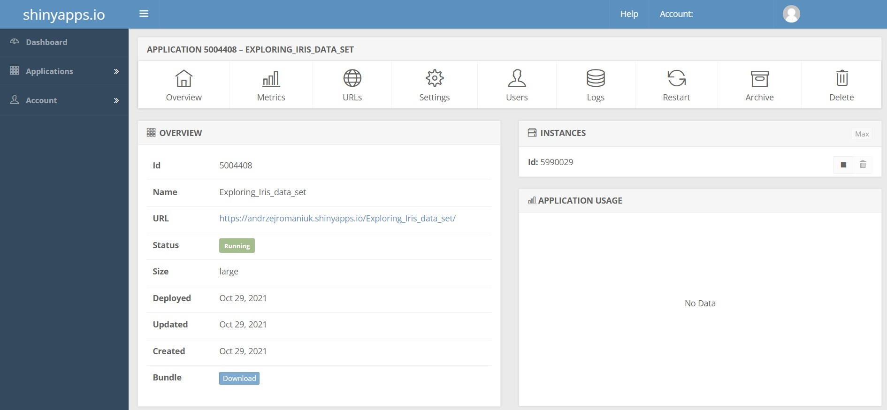
```

| 
*Przykład 2: Shinyapps.io*

| 
[Shinyapps.io](https://www.shinyapps.io/) to serwer dedykowany specjalnie do hostowania skompilowanych aplikacji Shiny. Darmowe konto jest stosunkowo restrykcyjne (tylko 25 godzin aktywnego użytkowania), ale jest dobrym punktem wyjścia dla początkujących programistów. Po stronie RStudio należy zainstalować bibliotekę *rsconnect*, a RStudio później skonfigurować do łączenia się z kontem *Shinyapps*. Po konfiguracji nowo utworzone aplikacje można łatwo skompilować i przesłać na swerwer *Shinyapps.io* poprzez przycisk *Opublikuj aplikację lub dokument*. Dalsze wdrażanie aplikacji (np. przypisanie unikatowego adresu URL) można konfigurować bezpośrednio z interfejsu użytkownika *Shinyapps.io*. Szczegółowy przewodnik publikowania w ten sposób, krok po kroku, dostępny jest [tutaj](https://shiny.rstudio.com/articles/shinyapps.html).
| 
Warto zauważyć, że skompilowane zależności obejmują również biblioteki. Może to spowodować, że ostateczna aplikacja będzie dość ciężka, jeśli użyjesz funkcji z wielu lub większych bibliotek. Jeśli używasz tylko jednej funkcji z określonej biblioteki, lepiej użyć *::* by załadować indywidualną funkcję niż wczytywać całą bibliotekę poprzez *library()*.

\pagebreak
\begin{center}
\rule{1\textwidth}{.4pt}
\end{center}

## Uwagi końcowe {#remarks}

| 
| 

Jeżeli przeszedłeś przez cały samouczek i chcesz teraz wykorzystać nowo nabyte umiejętności w praktyce, sugeruję zacząć od pisania małych, łatwo zrozumiałych aplikacji. Dobrym punktem wyjścia może być próba odtworzenia analizy, którą już kiedyś zrobiłeś, jako aplikacji internetowej, lub stworzenie interaktywnej wizualizacji zbioru danych, który dobrze znasz. 

Z czasem możesz przejść do dalszego zagłębiania wiedzy o możliwościach zawartych w bibliotekach Shiny oraz hostingu aplikacji online (zobacz następną stronę, zwłaszcza książki dostępne online, jak np. [*Mastering Shiny*](https://mastering-shiny.org/)) lub połączyć rozwiązania dostępne w Shiny z innymi rozwiązaniami dostępnymi *poprzez* RStudio (np. z RMarkdown, zobacz poniżej).

| 
| 

*Shiny i RMarkdown*

| 
Co zrobić, jeśli chcesz stworzyć prezentację z osadzoną aplikacją? A może całą witrynę,  zawierającą kilka różnych aplikacji? Jest to jak najbardziej możliwe dzięki połączeniu Shiny z biblioteką RMarkdown. Podobnie jak Shiny, RMarkdown jest zestawem rozwiązań, dodającym zupełnie nowe funkcjonalności do RStudio. W szczególności służy do tworzenia raportów w postaci m.in. strony html, dokumentu pdf lub prezentacji. Samouczek został napisany i zakodowany w pliku pdf dzięki RMarkdown i rozszerzeniu MiKTeX (RMarkdown może poprosić o zainstalowanie rozszerzeń lub zapytać o konieczność ręcznej instalacji; nie martw się, nie jest to tak skomplikowane, jak się wydaje).

Kurs LinkedIn Learning o łączeniu RMarkdown z Shiny jest dostępny  [tutaj](https://www.linkedin.com/learning/creating-interactive-presentations-with-shiny-and-r/welcome?u=50251009), więcej informacji o możliwościach takiego połączenia oraz przydatnych linkach jest dostępnych  [tutaj](https://beta.rstudioconnect.com/content/2671/Combining-Shiny-R-Markdown.html#introduction). Warto również przeczytać więcej o roli RMarkdown w pisaniu naukowych raportów w [*R Markdown for Scientists*](https://rmd4sci.njtierney.com/index.html).

\pagebreak
\begin{center}
\rule{1\textwidth}{.4pt}
\end{center}

## Dalsza nauka {#furtherreading}

| 
| **Shiny, strona główna projektu**
| [https://shiny.rstudio.com/](https://shiny.rstudio.com/)
| 
| **Shiny, szkolenia**
| (Oficjalne samouczki bezpłatne, samouczki LinkedIn bezpłatne dla studentów wybranych uczelni; reszta zależy od strony)
| [Oficjalne samouczki (Początkujący)](https://shiny.rstudio.com/tutorial/)
| [*a gRadual intRoduction to Shiny* (Początkujący)](https://laderast.github.io/gradual_shiny/)
| [TDS: *All you need to know to build your first Shiny app* (Przegląd kluczowych informacji)](https://towardsdatascience.com/all-you-need-to-know-to-build-your-first-shiny-app-653603fd80d9)
| [LinkedIn Learning: *Building data apps with R and Shiny: Essential Training* (Początkujący)](https://www.linkedin.com/learning/building-data-apps-with-r-and-shiny-essential-training/build-test-and-deploy-apps-easily-in-shiny?u=50251009)
| [LinkedIn Learning: *Creating interactive presentations with Shiny and R* (Początkujący)](https://www.linkedin.com/learning/creating-interactive-presentations-with-shiny-and-r/welcome?u=50251009)
| [DataCamp: *Shiny fundamentals with R* (Początkujący)](https://www.datacamp.com/tracks/shiny-fundamentals-with-r?tap_a=5644-dce66f&tap_s=463826-784532&irclickid=SOUUtsxeLxyITXGxavSWgyt9UkBXtywdHQhF280&irgwc=1)
| [UDEMY, available Shiny courses (Początkujący-Zaawansowany)](https://www.udemy.com/topic/shiny/?ranMID=39197&ranEAID=vedj0cWlu2Y&ranSiteID=vedj0cWlu2Y-__lLdGo1NtaPge2GVjICig&LSNPUBID=vedj0cWlu2Y&utm_source=aff-campaign&utm_medium=udemyads)
| [Oxford(GitHub): *Shiny app templates* (Informacje pomocnicze)](https://ox-it.github.io/OxfordIDN_Shiny-App-Templates/)
| [RStudio: Cheat Sheets](https://www.rstudio.com/resources/cheatsheets/)
| [RStudio: *Shiny in Production* (Prezentacja)](https://www.rstudio.com/resources/rstudioconf-2019/shiny-in-production-principles-practices-and-tools/)
| [Supplement to Shiny in Production (Początkujący-Średniozaawansowany)](https://kellobri.github.io/shiny-prod-book/index.html)
| 
| **Książki dostępne online**
| [*Mastering Shiny* (Początkujący-Średniozaawansowany)](https://mastering-shiny.org/)
| [*Mastering Shiny Solutions* (Początkujący-Średniozaawansowany)](https://mastering-shiny-solutions.org/)
| [*The Shiny AWS Book* (Średniozaawansowany-Zaawansowany)](https://business-science.github.io/shiny-production-with-aws-book/)
| [*Outstanding User Interfaces with Shiny* (Zaawansowany)](https://unleash-shiny.rinterface.com/)
| [*JavaScript for R* (Zaawansowany; fizyczna kopia też istnieje)](https://book.javascript-for-r.com/)
| [*JavaScript 4 Shiny - Field Notes* (Zaawansowany)](https://connect.thinkr.fr/js4shinyfieldnotes/)
| [*Engineering Production-Grade Shiny Apps* (Zaawansowany)](https://engineering-shiny.org/index.html)
| Aktualne informacje o kluczowych publikacjach [tutaj](https://www.bigbookofr.com/shiny.html)
|
| **Książki, papierowe/kindle**
| *Web Application Development with R Using Shiny - Third Edition (Początkujący-Średniozaawansowany)* (2018, C. Beeley & S.R. Sukhdeve, Packt Publishing Ltd)
| *Building Shiny Apps: Web Development for R users (English Edition) (Początkujący-Średniozaawansowany)* (2017, P. Macdonaldo)
|

\pagebreak
\begin{center}
\rule{1\textwidth}{.4pt}
\end{center}


## O samouczku

|
| 
Ten poradnik został napisany w Październiku 2021 roku przez Andrzeja A. Romaniuka dla Centrum Danych, Kultury i Społeczeństwa Uniwersytetu w Edynburgu (*Centre for Data, Culture and Society, University of Edinburgh*). Oryginalny tytuł *Building interactive web applications in R using SHINY*.  

Tłumaczenie na Polski zostało wykonane przez tego samego autora, w Maju/Czerwcu 2022 roku, z myślą o warsztacie „Projektowanie prostych aplikacji w R przy użyciu SHINY”, zorganizowanym w ramach konferencji *CAA – Forum GIS UW 2022*. Tytuł warsztatu został ostatecznym tytułem tłumaczenia.

| 
Sam dokument PDF został zbudowany w RStudio (wersja 1.3.1073; R wersja 4.02), przy użyciu biblioteki RMarkdown (wersja 2.7) i MiKTeX (dystrybucja Tex). Przedstawione diagramy (rys. 5-7) zostały wykonane w programie MS PowerPoint.

| 
Naklejka z logo Shiny, prezentowana na pierwszej stronie, pobrana została z repozytorium  [hex-stickers](https://github.com/rstudio/hex-stickers/tree/master/PNG), stworzonym specjalnie dla reklamowania R i powiązanych bibliotek oraz rozwiązań sieciowych.

| 
Oryginalny samouczek, w formacie PDF, jest dostępny poprzez własny link DOI jak i oryginalne repozytorium an GitHub:  [https://doi.org/10.5281/zenodo.5705151](https://doi.org/10.5281/zenodo.5705151)
[github.com/DCS-training/ShinyTutorial](https://github.com/DCS-training/ShinyTutorial)

| 
Wszystkie elementy niezbędne dla samouczka po Polsku, jak i dla przykładowej aplikacji, w tym wygenerowania pliku PDF, są dostępne na stronie GitHub:  [github.com/DCS-training/ShinyTutorial](https://github.com/AndrzejRomaniuk/ShinySamouczek)

| 
| Andrzej A. Romaniuk
| dr (archeologia), mgr (osteoarcheologia)
| Uniwerystet Edynburski, instruktor
| Narodowe Muzea Szkocji, wolontariusz naukowy
| **[CV](https://andrzejromaniuk.github.io/CV/)**
| **[Konto na ResearchGate](https://www.researchgate.net/profile/Andrzej-Romaniuk)**
| **[Repozytorium GitHub](https://github.com/AndrzejRomaniuk)**
| **[Identyfikator ORCID](https://orcid.org/0000-0002-4977-9241)**

